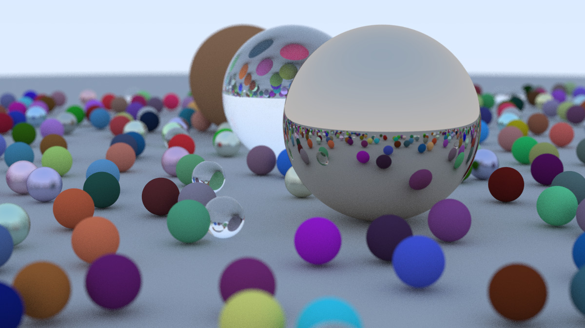

# Ray Tracer

Ray tracer made using the series of [Ray Tracing In A Weekend](https://raytracing.github.io/)

## Disclaimer

Code is not very performant at the moment the scene above took 26 minute for me to render at the release mode with **Intel(R) Core(TM) i5-11400H @ 2.70GHz, 2688 Mhz, 6 Core(s)** using total 6 cores. But higher hardware might took less time.

## TODO
- [x] Multithreading